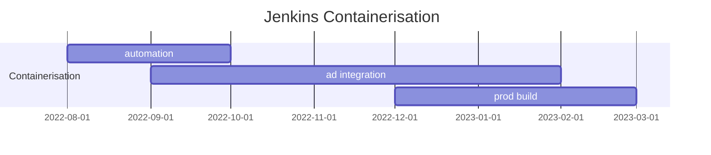

# What we know we know

## Where I only speak for myselves

This is written in first person plural style, for reasons I will explain later. In the meantime, just have fun.

Beauty can be found anywhare. Grow it where you find it.

Take engineering services for example. Elegance can be expressed. I find the following image pleasing to look at for the following reasons:

- The Jenkins container to which the schedule pertains is in production as I write
- It is laid out and rendered professionally - not due to my own efforts, but due to those of others better at layout and rendering than I
- It's source is inline human-readable markup in a text only file.
- Its source is maintained in a source control repository with built in change control, change control, and rendering support.

So many things to be happy about.

So that's what we think about most the time. Well, your milage probably varies. The what that we think about, allowing for topic, rendering, diagramming model, requirement, environment, staff, etc. Engineering brief, I suppose.

The rest of the time, the I find life inevitably taking the form of engineering brief. I am sure that is so for any career.

In any case, as ar as writing goes, I have produced much documentation, all technical, and have found the occupation eudaimonic only on occasion. I have tried to categorise the writing I have done, so as to 

If you are familiar with the Waterfall Development Lifecycle, then you will know what 
The majority of the documentation I 

I find myself in the fortunate position of having time to reflect. And have decided to write these refelections, if for no other reason than to refelect on my reflections. As indulgent as that may sound.

Backstory
I have to confess a lie, whan I say 
 
