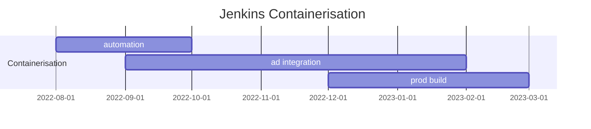

# What we know we know

## Where I only speak for myselves

This is written in first person plural style, for reasons I will explain later. In the meantime, just have fun.

Beauty can be found anywhare. Grow it where you find it.

Take engineering services for example. Elegance can be expressed. I find the following image pleasing to look at for the following reasons:

- The Jenkins container to which the schedule pertains is in production as I write
- It is laid out and rendered professionally - not due to my own efforts, but due to those of others better at layout and rendering than I
- It's source is inline human-readable markup in a text only file.
- Its source is maintained in a source control repository with built in change control, change control, and rendering support.

So many things to be happy about.

 
