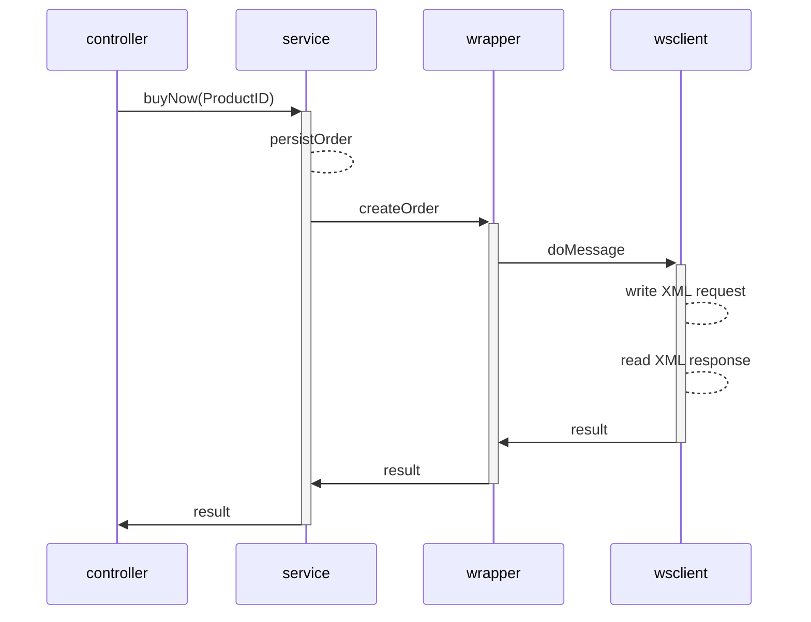
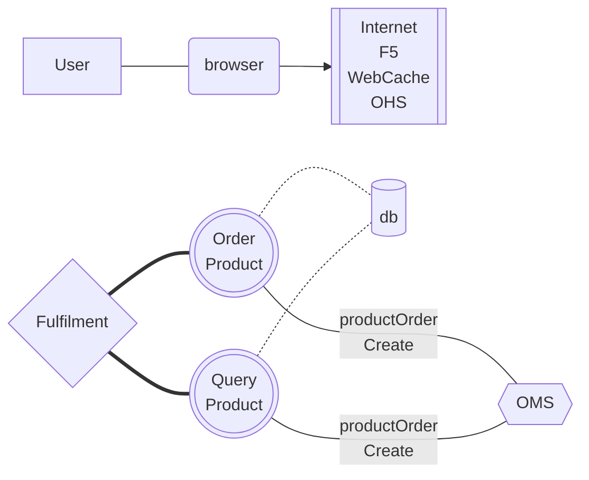
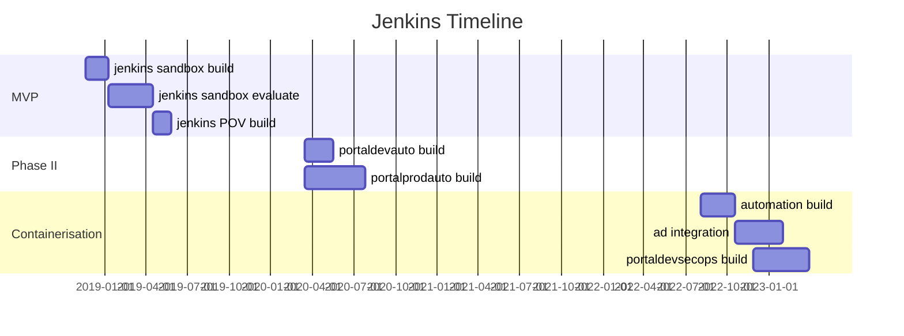

# Mermaid

```mermaid

sequenceDiagram
  controller ->>+ service: buyNow(ProductID)
  service --> service: persistOrder
  service ->>+ wrapper: createOrder
  wrapper ->>+ wsclient: doMessage
  wsclient --> wsclient: write XML request
  wsclient --> wsclient: read XML response
  wsclient ->>- wrapper: result
  wrapper ->>- service: result
  service ->>- controller: result
```

```mermaid
flowchart LR
User ---
A(browser) -->
B[[Internet\nF5\nWebCache\nOHS]]
C{Fulfilment} ===
D(((Order\nProduct))) -.-
E[(db)] 
D ----|productOrder\nCreate|F{{OMS}} 
C ===
G(((Query\nProduct))) -.-
E
G ----|productOrder\nCreate|F{{OMS}} 
```

```mermaid
gantt
    title Jenkins Timeline
    dateFormat  YYYY-MM-DD
    section MVP
        jenkins sandbox build : m1, 2018-11-19, 2019-01-08
        jenkins sandbox evaluate:  m2, 2019-01-08, 2019-04-17
        jenkins POV build: m3,  2019-04-17, 2019-05-27
    section Phase II
        portaldevauto build: p1, 2020-03-16, 2020-05-18
        portalprodauto build: p2, 2020-03-16, 2020-07-27
    section Containerisation
        automation build: c2, 2022-08-03, 2022-10-19
        ad integration: c3, 2022-10-19, 2023-02-01
        portaldevsecops build: c5, 2022-11-27, 2023-03-30 
```
